# Getting Started 

## Development Environment

The sample application is supplied for Windows 10 and above to demonstrate using the SDK.  
- Microsoft Visual Studio 2019 is required to build the sample code.  
- .NET Core Runtime 3.1 is required for the Client Tray application. 

A Wacom display tablet such as DTU-1141 must be installed to use the application. 
This must appear as a separate display in Windows Display Settings. 

In Windows Display Settings select the Wacom tablet display and drag it to arrange the required order:

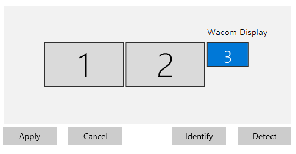

Scroll the Settings page to the Multiple displays section then select Extend:

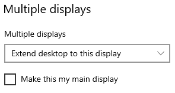


## Download the Wacom Ink SDK for multi-display

Download the SDK from https://developer.wacom.com/developer-dashboard

* Login using your Wacom ID
* Select **Downloads for multi-display**
* Download **Wacom Ink SDK for multi-display**
* Accept the End User License Agreement to use the SDK

The downloaded Zip file contains the SDK with documentation.

## Download an Evaluation License

A license is needed to use the SDK and a fully functional evaluation license is free to download as follows:

* Navigate to https://developer.wacom.com/developer-dashboard
* login using your Wacom ID
* Select **License Keys**
* Select **Create Evaluation License Keys**
* Select **Generate Evaluation License** for Wacom Ink SDK for multi-display
* Return to License Keys where the new license file is ready for download
* Download the license file

The license is supplied as a JWT text string in a text file.
This will need to be copied into your application, detailed below.
The self-service evaluation licenses have a three-month expiry date from the time of creation.
However you can generate a new license at any time. 

---

# Sample Application

## Download compatible sample code

The application is under constant development and as a result incompatibility can occur between SDK versions.  
Check the version of the installed SDK and choose the matching GitHub branch if one is available.  
Otherwise more recent SDK versions will use the master branch.  
For example, at the time of writing, the SDK version available for download is *v1.0.6*  
Therefore download and use the Sample Code in the branch labelled *v1.0.6* in this repository.


## Install the Client Tray Application

The Client Tray application is supplied in an msi installer in the SDK Client folder.
Run the installer to install the application in  
```Program Files (x86)\Wacom Ink SDK for Multi-Display```

The Tray App ```Wacom.Kiosk.App.exe``` runs on user login or can be started manually from the Windows Start menu if necessary:  
```Wacom Ink SDK for Multi-Display```

On startup the Client Tray application displays the default slideshow configured for Idle mode. 

## License the application

Before running the sample Server application a license must be installed.
The license is supplied separately as a JWT license string. Paste this into the Sample Code license file: ```App.config```  
i.e. replace the string in the tag: 
```<add key="license" value="PASTE YOUR KEY HERE"/>```


----
## Build the Sample Code

Open the project file ```Wacom.Kiosk.IntegratorUI.sln``` in Visual Studio 2019
The project uses specific NuGet packages as follows:
```
Wacom.Kiosk.SDK     // included in the SDK download: Wacom.Kiosk.SDK.1.0.1.2.nupkg
                    // copy the file to a suitable folder in the project
WatsonTcp           // v4.3.0.3
```
To install the SDK NuGet package follow the steps:

- select *Manage NuGet Packages...* (right click the solution project to display the menu)
- select Settings (click the gearwheel icon)
- select or Add the package source 'kiosk' (to add the package click the + button)
- browse to the SDK folder containing ```Wacom.Kiosk.SDK.nupkg``` (use the ... button)
- select Update
- locate ```Wacom.Kiosk.SDK``` in the Installed  packages list and install or update as required

Similarly ensure that the correct version of the ```WatsonTcp``` package is installed (select All as Package Source in the NuGet package manager).


In Visual Studio select Debug, Any CPU   
Build Solution

Run the sample server application.
On startup the window display will appear. The *'received message'* display indicates a successful connection to the server:

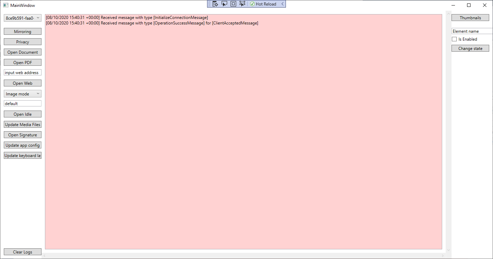

Details of the different modes of operation can be found in the developer documentation:
[Wacom Ink SDK for multi-display](https://developer-docs.wacom.com/sdk-for-multi-display/)

On startup a message exchange between the server application and client tray app establishes a connection shown in the screenshot.
Throughout its operation the sample Server app displays a summary of messages received from the Client app. 

## Sample App Menu Options

### Mirroring
Mirroring toggles the option of mirroring the tablet display in a window. Pen input on the tablet is simulated using the mouse, e.g. right-click the mouse to simulate a button click.

### Privacy
When the Mirror window has been enabled, its contents can be blanked for privacy. The button toggles the privacy state.

### Open Document


Opens a PDF document on the tablet. The document can be scrolled and pages navigated. Input fields can be completed using the tablet pen with a virtual keyboard.

The parameters required for the function are set through a dialog, for example:

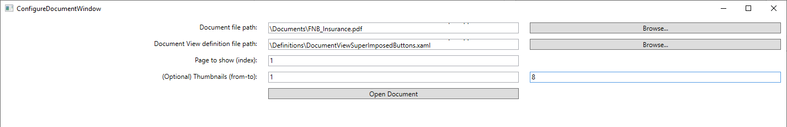

The parameter selections are defined as follows:

* Document file path: full path to the PDF document to be opened
* Document View definition file path: full path to the XAML definition
* Page to show (index): Page number to display
* (Optional) thumbnails (from-to):  values indicating the start and end points for the page thumbnail images

The xaml definition file defines the layout of the display and the controls to be included. A number of sample definitions are included, for example with and without the thumbnail display.

Further details can be found in *Document View* in [Wacom Ink SDK for multi-display](https://developer-docs.wacom.com/sdk-for-multi-display/)

### Open PDF
Opens a PDF document for display only.

A dialog provides selection of the PDF:

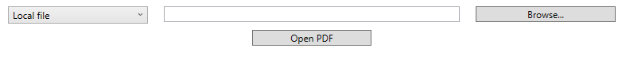

The PDF can be a local file or an external URL.

See *PDF Display* in [Wacom Ink SDK for multi-display](https://developer-docs.wacom.com/sdk-for-multi-display/) for further details.

### Open Web
Opens the web page specified in the 'input web address' field.
The web page can be navigated through its links but data input is not supported.

See *Web Display* in [Wacom Ink SDK for multi-display](https://developer-docs.wacom.com/sdk-for-multi-display/) for further details.

### Open Idle
Selects Idle mode on the tablet display determined by dropdown:

* Image mode
* Video mode

Using the idle file collection 'default' or by a custom name set in 'Update Media Files' 

See *Idle Mode* in [Wacom Ink SDK for multi-display](https://developer-docs.wacom.com/sdk-for-multi-display/) for further details.

### Update Media Files

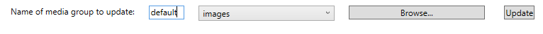

Copies image or video files to the selected media folder.
For example set custom name 'demo', browse to a collection of image files, select one or more files, open.
Update then copies the files to the custom folder, e.g. ```media\images\custom\demo```

Similarly the default images can be updated in ```media\default```

Further details can be found in the Introduction *Idle Mode* [Wacom Ink SDK for multi-display](https://developer-docs.wacom.com/sdk-for-multi-display/)

### Open Signature
Selects signature capture on the tablet display.

The parameters required for the function are set through a dialog, for example:

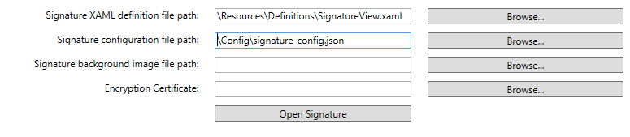

As a minimum the command requires`

* xaml definition for the signature capture window contents and layout
* JSON parameters for the signature capture function

As an option the capture window can be supplied with a background image.
Optionally the signature data can be encrypted by supplying a .CER certificate.

See *Signature View* in [Wacom Ink SDK for multi-display](https://developer-docs.wacom.com/sdk-for-multi-display/) for further details.

### Update App config
A dialog is used to select an alternative app_config.json file for the Client app:

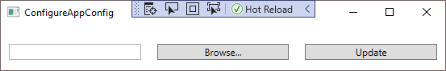

On completion the Client configuration file is overwritten with the supplied file:

```Wacom Ink SDK for Multi-Display\Config\app_config.json```

Changes made in the configuration will take effect when the Client tray app is restarted.

Further details can be found here: *Client Configuration* in [Wacom Ink SDK for multi-display](https://developer-docs.wacom.com/sdk-for-multi-display/)


### Update Keyboard Layout
A dialog is used to select a new keyboard layout:

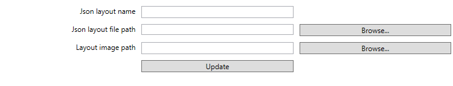

See *Keyboard Layout* in [Wacom Ink SDK for multi-display](https://developer-docs.wacom.com/sdk-for-multi-display/) for details.

On successful completion the Client fileset is updated in:
```Wacom Ink SDK for Multi-Display\Resources\Keyboards```

Changes made in the configuration will take effect when the Client tray app is restarted.

### Thumbnails
Use this dialog to upload additional thumbnail page images for a document previously opened using Open Document.
Thumbnails are optional when a document is opened and additional images can be uploaded using this command.
Thumbnails can be uploaded separately to reduce the initial document display time.
See *Document View - Thumbnail data* in [Wacom Ink SDK for multi-display](https://developer-docs.wacom.com/sdk-for-multi-display/)


### Change state
Use this feature to enable or disable buttons in the currently displayed Document View:

For example, in the *DocumentView* xaml example in [Wacom Ink SDK for multi-display](https://developer-docs.wacom.com/sdk-for-multi-display/) the button used to select thumbnails is identified as:

```<Button x:Name="ThumbnailsBtn"``` 

In the input field enter the name of the control:

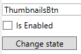

Change state will remove the button from the document view on the tablet and Mirror.

The button can then be restored by checking the IsEnabled field.

---
----
## Troubleshooting

### NuGet packages

If the sample code fails to build related to NuGet packages, note that the cache can be cleared by deleting the cache folder, for example:
```rmdir %userprofile%\.nuget\packages\wacom.kiosk.sdk```

### Tablet pen not working

Reset the driver pen settings as follows:
```
Run:
C:\Program Files\Tablet\Wacom\32\PrefUtil.exe  
Click: 
All User Preferences ... [ Remove ]
```

NB: in recent driver versions, PrefUtil.exe is located in C:\Program Files\Tablet\Wacom\PrefUtil.exe

### On-screen keyboard

Using a touch display, if the on-screen keyboard appears when a textbox is selected modify the settings by turning off *Show the touch keyboard when not in tablet mode and there's no keyboard attached* as follows: 

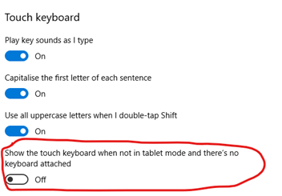

### DTH recommended configuration

#### Show Touch Keyboard - Off

Go to: **Settings...Devices...Typing**
In the Touch Keyboard section set:
*"Show the touch keyboard when not in tablet mode and there's no keyboard attached" to OFF*

#### Show Taskbar - Off

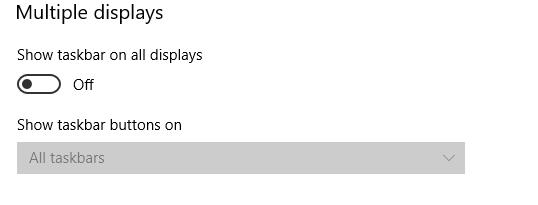

#### Calibrate Touch
  
Windows touch input is mapped by the operating system. The Wacom driver attempts to override this but may not always be successful in certain environments. Touch mapping is easily set through the Tablet PC Settings. See:

https://developer-docs.wacom.com/faqs/docs/q-tablet/tablet-driver#dth-1152-touch-works-on-primary-monitor-instead-of-the-extended-screen

----
----


