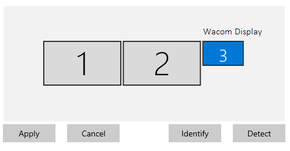
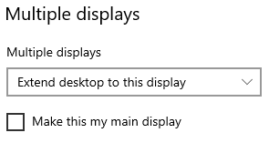
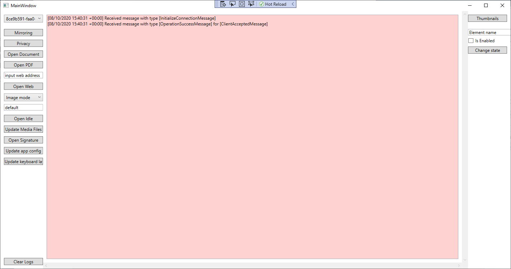
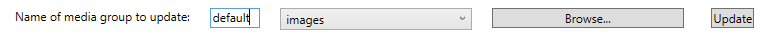
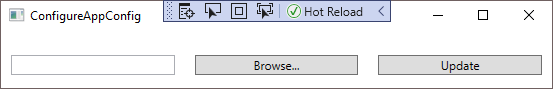

# はじめに

## 開発環境

サンプルアプリケーションは、SDKの使用方法を示すために Windows10 以降用に提供されています。
- サンプルコードをビルドするには、Microsoft Visual Studio 2019 が必要です。
- Client Tray Application には、.NET Core ランタイム 3.1 が必要です。

アプリケーションを使用するには、DTU-1141などのWacom ディスプレイ タブレットをインストールする必要があります。
これは、Windowsのディスプレイ設定で個別のディスプレイとして表示される必要があります。

Windowsのディスプレイ設定で、Wacom ディスプレイ タブレットを選択し、ドラッグして必要な順序を調整します。



[設定]ページで[マルチ ディスプレイ]セクションまでスクロールし、[表示画面を拡張する]を選択します。




## Wacom Ink SDK for multi-display をダウンロードする

https://developer.wacom.com/developer-dashboard からSDKをダウンロードします、

* Wacom IDを使用してログインします
* [**multi-displayのダウンロード**]を選択します
* **Wacom Ink SDK for multi-display** をダウンロードします
* SDKを使用するには、エンドユーザー使用許諾契約に同意します

ダウンロードしたZipファイルには、ドキュメント付きのSDKが含まれています。

## 評価ライセンスをダウンロードする

SDKを使用するにはライセンスが必要であり、完全に機能する評価ライセンスは次のように無料でダウンロードできます。

* https://developer.wacom.com/developer-dashboard に移動します
* Wacom IDを使用してログインします
* **ライセンスキー** を選択します
* **評価ライセンスキーの作成** を選択します
* Wacom Ink SDK for multi-display の **Generate Evaluation License** を選択します
* 新しいライセンスファイルをダウンロードする準備ができたらライセンスキーに戻ります
* ライセンスファイルをダウンロードします

ライセンスは、テキストファイルでJWTテキスト文字列として提供されます。
これは、以下に詳述するように、アプリケーション内にコピーする必要があります。
セルフサービスの評価ライセンスには、作成時から3か月の有効期限があります。
ただし、いつでも新しいライセンスを生成できます。

---

# サンプル アプリケーション

## Client Tray Applicationをインストール

Client Tray Application は、SDK Client フォルダー中の msi インストーラーで提供されます。
インストーラーを実行して、アプリケーションをにインストールします

```Program Files (x86)\Wacom Ink SDK for Multi-Display```

Trayアプリ ```Wacom.Kiosk.App.exe```は、ユーザーログイン時に実行されるか、必要に応じてWindows スタートメニューの ```Wacom Ink SDK for Multi-Display``` から手動で起動することができます。

Client Tray Application は、起動時にアイドルモード用に構成されたデフォルトのスライドショーを表示します。

## アプリケーションのライセンス

サンプル サーバー アプリケーションを実行する前に、ライセンスをインストールする必要があります。
ライセンスは、JWTライセンス文字列として個別に提供されます。これをサンプルコード ライセンスファイルに貼り付けます：```App.config```

つまり、次のタグ内の文字列をライセンスキー文字列で置き換えてください：
```<add key="license" value="PASTE YOUR KEY HERE"/>```


--------
## サンプルコードを作成する

Visual Studio 2019 で ```Wacom.Kiosk.IntegratorUI.sln``` プロジェクトファイルを開きます。
このプロジェクトでは、次に示すに示す特定のNuGetパッケージを使用します、
```
Wacom.Kiosk.SDK // SDKダウンロードに含まれています：Wacom.Kiosk.SDK.1.0.1.2.nupkg
                    //ファイルをプロジェクト内の適切なフォルダにコピーします
WatsonTcp // v4.3.0.3
```
SDK NuGetパッケージをインストールするには、次の手順に従ってください、

- [*NuGetパッケージの管理...*] を選択します（ソリューションプロジェクトを右クリックしてメニューを表示します）
- [設定] を選択します（歯車アイコンをクリックします）
- パッケージソースで「kiosk」を選択または追加します（パッケージを追加するには、[+]ボタンをクリックします）
- ```Wacom.Kiosk.SDK.nupkg```を含むSDKフォルダーを参照します（[...]ボタンを使用）
- [更新] を選択します
- [インストール済みパッケージ] リストで ```Wacom.Kiosk.SDK``` を見つけ、必要に応じてインストールまたは更新します

同様に、正しいバージョンの ```WatsonTcp``` パッケージがインストールされていることを確認します（NuGetパッケージの管理の[パッケージ ソース]リストで [すべて] を選択します）。

Visual Studioで、[Debug]、[Any CPU]を選択します。

ソリューションをビルドします。

サンプルサーバーアプリケーションを実行します。
起動時にウィンドウ表示が表示されます。 *'受信メッセージ'* 表示は、サーバーへの接続が成功したことを示します。



さまざまな操作モードの詳細は、開発者向けドキュメント
[Wacom Ink SDK for multi-display](https://developer-docs.wacom.com/sdk-for-multi-display/) に記載されています。

起動時に、サーバーアプリケーションとClient Tray Application 間のメッセージ交換により、スクリーンショットに示す接続が確立されます。
サンプルサーバーアプリは、その操作を通じて、クライアントアプリから受信したメッセージの概要を表示します。

## サンプルアプリ メニューオプション

### ミラーリング（Mirroring）
ミラーリングは、ウィンドウ内のディスプレイタブレットをミラーリングするオプションを切り替えます。タブレットでのペン入力は、マウスを使用してシミュレートされます。マウスを右クリックして、ボタンクリックをシミュレートします。

### プライバシー (Privacy)
ミラーウィンドウが有効になっている場合、プライバシー保護のためにその内容を空白にすることができます。ボタンはプライバシー状態を切り替えます。

### ドキュメントを開く(Open Document)
タブレットでPDFドキュメントを開きます。ドキュメントをスクロールしたり、ページをナビゲートしたりできます。入力フィールドは、仮想キーボードを備えたタブレットペンを使用して入力できます。

関数に必要なパラメータは、ダイアログを介して設定されます。次に例を示します。


パラメータの選択は次のように定義されています。

* ドキュメントファイルパス：PDFを開くドキュメントへのフルパス
* ドキュメントビュー定義ファイルパス：XAML定義へのフルパス
* 表示するページ（索引）：表示するページ番号
* （オプション）サムネイル（from-to）：ページのサムネイル画像の開始点と終了点を示す値

xaml定義ファイルは、表示のレイアウトと含まれるコントロールを定義します。サムネイル表示の有無など、いくつかのサンプル定義が含まれています。

詳細については、[Wacom Ink SDK for multi-display](https://developer-docs.wacom.com/sdk-for-multi-display/) の *Document View* をご覧ください。

### PDFを開く (Open PDF)
表示専用のPDFドキュメントを開きます。

ダイアログでPDFを選択できます。


PDFは、ローカルファイルまたは外部URLにすることができます。

詳細については、[Wacom Ink SDK for multi-display](https://developer-docs.wacom.com/sdk-for-multi-display/) の *PDF Display* を参照してください。

### ウェブを開く (Open Web)
[[入力Webアドレス] フィールドで指定されたWebページを開きます。
Webページはそのリンクを介してナビゲートできますが、データ入力はサポートされていません。

詳細については、[Wacom Ink SDK for multi-display](https://developer-docs.wacom.com/sdk-for-multi-display/) の *Web Display* を参照してください。

### アイドルを開く (Open Idle)
ドロップダウンによって決定されるタブレット ディスプレイでアイドルモードを選択します。

* 画像モード
* ビデオモード

アイドルファイルコレクション「デフォルト」または「メディアファイルの更新」で設定されたカスタム名を使用します

詳細については、[Wacom Ink SDK for multi-display](https://developer-docs.wacom.com/sdk-for-multi-display/) の *Idle Mode* を参照してください。

### メディアファイルを更新 (Update Media Files)



選択したメディアフォルダに画像またはビデオファイルをコピーします。
たとえば、カスタム名「デモ」を設定し、画像ファイルのコレクションを参照し、1つ以上のファイルを選択して、開きます。
次に、更新によりファイルがカスタムフォルダにコピーされます。 ```media\images\custom\demo```

同様に、デフォルトの画像は ```media\default```で更新できます。

詳細については、はじめに[Wacom Ink SDK for multi-display](https://developer-docs.wacom.com/sdk-for-multi-display/) の *Idle Mode*  を参照してください。

### 電子サインを開く (Open Signature)
ディスプレイタブレットで電子サイン キャプチャを選択します。

関数に必要なパラメータは、ダイアログを介して設定されます。次に例を示します。


少なくとも、コマンドには `が必要です

* 電子サイン キャプチャウィンドウのコンテンツとレイアウトのxaml定義
* 電子サイン キャプチャ機能のJSONパラメータ

オプションとして、キャプチャウィンドウに背景画像を提供できます。
オプションで、.CER証明書を提供することにより、電子サインデータを暗号化できます。

詳細については、[Wacom Ink SDK for multi-display](https://developer-docs.wacom.com/sdk-for-multi-display/) の *Signature View* を参照してください。

### アプリ構成の更新 (Update app config)
ダイアログを使用して、クライアントアプリの代替app_config.jsonファイルを選択します。



完了すると、クライアント構成ファイルは提供されたファイルで上書きされます。

```Wacom Ink SDK for Multi-Display\Config\app_config.json```

構成に加えられた変更は、Client Tray Application を再起動したときに有効になります。

詳細については、[Wacom Ink SDK for multi-display](https://developer-docs.wacom.com/sdk-for-multi-display/) の *Client Tray App Configuration* を参照してください。


### キーボードレイアウトの更新 (Update keyboard layout)
ダイアログを使用して、新しいキーボードレイアウトを選択します。


詳細については、[Wacom Ink SDK for multi-display](https://developer-docs.wacom.com/sdk-for-multi-display/) の *Keyboard Layout* を参照してください。

正常に完了すると、クライアントファイルセットは次の場所で更新されます。
```Wacom Ink SDK for Multi-Display\Resources\Keyboards```

構成に加えられた変更は、Client Tray Application を再起動したときに有効になります。

### サムネイル (Thumbnails)
このダイアログを使用して、ドキュメントを開く (Open Document)を使用して以前に開いたドキュメントの追加のサムネイルページ画像をアップロードします。
ドキュメントを開いたときのサムネイルはオプションであり、このコマンドを使用して追加の画像をアップロードできます。
サムネイルを個別にアップロードして、ドキュメントの初期表示時間を短縮できます。
[Wacom Ink SDK for multi-display](https://developer-docs.wacom.com/sdk-for-multi-display/) の *Document View - Thumbnail Data* を参照してください。


### 状態を変更 (Change state)
この機能を使用して、現在表示されているドキュメントビューのボタンを有効または無効にします。

たとえば、[Wacom Ink SDK for multi-display](https://developer-docs.wacom.com/sdk-for-multi-display/) の *Document View - Thumbnail data*  を参照してください。xamlの例では、サムネイルの選択に使用されるボタンが識別されています。従って：

```<Button x:Name="ThumbnailsBtn"``` 

入力フィールドに、コントロールの名前を入力します。


状態を変更すると、タブレットとミラーのドキュメントビューからボタンが削除されます。

次に、IsEnabledフィールドをチェックすることでボタンを復元できます。

---
--------
## トラブルシューティング

### NuGetパッケージ

NuGetパッケージに関連するサンプルコードのビルドに失敗した場合は、キャッシュフォルダーを削除することでキャッシュをクリアできることに注意してください。次に例を示します、

```rmdir %userprofile%\.nuget\packages\wacom.kiosk.sdk```

### タブレットペンが機能しない

次のようにタブレットドライバーの設定をリセットします。
```
実行：
C：\Program Files\Tablet\Wacom\32\PrefUtil.exe
クリック：
すべてのユーザー設定... [削除]
```

### オンスクリーンキーボード

タッチディスプレイを使用して、テキストボックスが選択されているときにオンスクリーンキーボードが表示される場合は、オフにして設定を変更します。*タブレットモードではなく、キーボードが接続されていないときにタッチキーボードを表示します*。


### DTH推奨構成

#### タッチキーボードを表示-オフ

移動：**設定...デバイス...入力**
タッチキーボードセクションセット：
*「タブレットモードではなく、キーボードが接続されていないときにタッチキーボードを表示する」をオフに*

#### タスクバーを表示-オフ


#### タッチの調整
  
Windowsタッチ入力は、オペレーティングシステムによってマップされます。 Wacomドライバーはこれをオーバーライドしようとしますが、特定の環境では常に成功するとは限りません。タッチマッピングは、タブレットPCの設定から簡単に設定できます。参照：

https://developer-docs.wacom.com/faqs/docs/q-tablet/tablet-driver#dth-1152-touch-works-on-primary-monitor-instead-of-the-extended-screen

--------
--------