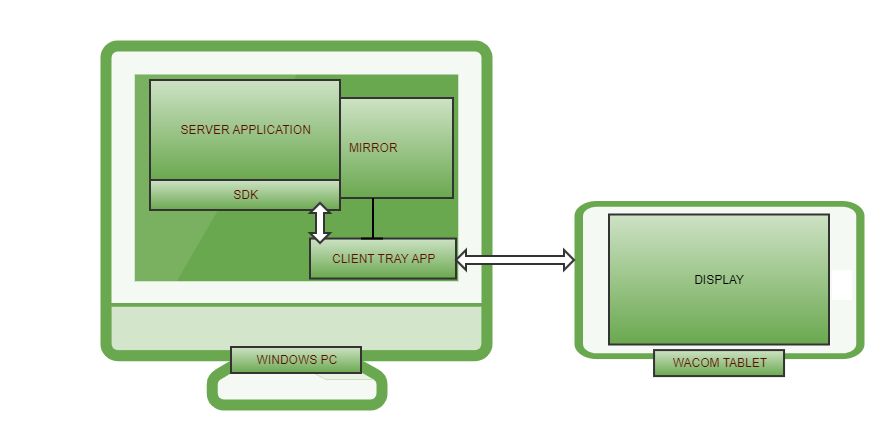

# Wacom Ink SDK for multi-display

> **Version 2 of the Wacom Ink SDK for multi-display, based on .NET 8, has been released!** 
>
> **Please note that, due to .NET Core 3.1 eventually no longer receiving bug fixes, version 1 will be supported for a limited period after the release of version 2.**
>
> **It is recommended to upgrade from version 1 to version 2 of the SDK.** 

**NOTICE:**

All of the content provided in this repository is **classified as Wacom Confidential Material**, therefore the signed NON-DISCLOSURE AGREEMENT applies.
Be aware that the **technology components are still under active development** with minimal QA testing, and **API interfaces and functionality could be changed or removed**.

---

## **Introduction**

Use the Wacom Ink SDK for multi-display to present an application on a Wacom tablet display in such a way that it is isolated from normal Windows cursor controls:

### **System Components:**

**Server Application** – the application is created using the SDK to communicate with the Client Tray application. The business logic in the server app controls the display content on the connected Wacom tablet and processes pen input from the device.

**SDK** – a collection of libraries is included in a .NET NuGet package. The API includes support for:

- messaging between the Server and Client applications
- PDF utilities used to parse PDF documents into image and input field definitions  
- JSON configurations used to define the different modes of operation

Messages exchanged between the Server and Control applications are used to switch between different tablet modes, retrieve input data and render images on the tablet display.

**Client tray application** – the application is installed in the Windows system tray and communicates with the Server application over TCP. The Client application uses the installed Wacom tablet driver to update the tablet display and receive pen input over the USB cable interface.

**Mirror** – optionally the Client application will reproduce the tablet display in a window and support mouse input to emulate tablet pen input.

**Wacom tablet display** – the Wacom tablet is treated as a separate Windows display and controlled by the Client application to support:

- image display
- pen input
- disabled mouse control - the Windows mouse cursor is prevented from entering the display area

### General operation

The Client application supports several modes under control of the Server:

* *document display* – displays a document with scroll and page navigation
* *PDF Document display* – displays a PDF document with form field input. Wacom pen input is used to fill the fields with virtual keyboard support
* *Signature mode* – captures a biometric signature using pen input  
* *Web display* – displays a web page
* *Idle mode* – presents a slideshow of images or videos until switched to an alternative mode
* *Mirror* – the tablet display can be simultaneously reproduced in a mirror window

The different modes are selected by the Server application using the SDK API with JSON configuration data. 
Details of these actions can be found in the [Getting Started guide](GETTING-STARTED.md).

---
# Additional resources 

## Sample Code
For further samples check Wacom's Developer additional samples, see [https://github.com/Wacom-Developer](https://github.com/Wacom-Developer)

## Documentation
For further details on using the SDK see [Wacom Ink SDK for multi-display](http://developer-docs.wacom.com/sdk-for-multi-display/) 

The API Reference is available directly in the downloaded SDK via the supplied NuGet file. The API components and their descriptions can be viewed within Visual Studio. 

## Support
If you experience issues with the technology components, please see related [FAQs](https://developer-support.wacom.com/hc/en-us)

For further support file a ticket in our **Developer Support Portal** described here: [Request Support](https://developer-support.wacom.com/hc/en-us/requests/new)

## Developer Community 
Join our developer community:

- [LinkedIn - Wacom for Developers](https://www.linkedin.com/company/wacom-for-developers/)
- [Twitter - Wacom for Developers](https://twitter.com/Wacomdevelopers)

## License 
This sample code is licensed under the [MIT License](https://choosealicense.com/licenses/mit/)

---

## Technology Usage
**No Commercial Use**. NOTWITHSTANDING ANYTHING TO THE CONTRARY, THIS AGREEMENT DOES NOT CONVEY ANY LICENSE TO USE THE EVALUATION MATERIALS IN PRODUCTION, OR TO DISTRIBUTE THE EVALUATION MATERIALS TO ANY THIRD PARTY. THE PARTNER ARE REQUIRED TO EXECUTE A SEPARATE LICENSE AGREEMENT WITH WACOM BEFORE MANUFACTURING OR DISTRIBUTING THE EVALUATION MATERIALS OR ANY PRODUCTS THAT CONTAIN THE EVALUATION MATERIALS. The Partner hereby acknowledge and agree that: (i) any use by The Partner of the Evaluation Materials in production, or any other distribution of the Evaluation Materials is a material breach of this Agreement; and (ii) any such unauthorized use or distribution will be at The Partner sole risk. No such unauthorized use or distribution shall impose any liability on Wacom, or any of its licensors, whether by implication, by estoppel, through course of dealing, or otherwise. The Partner hereby agree to indemnify Wacom, its affiliates and licensors against any and all claims, losses, and damages based on The Partner use or distribution of the Evaluation Materials in breach of this Agreement.

